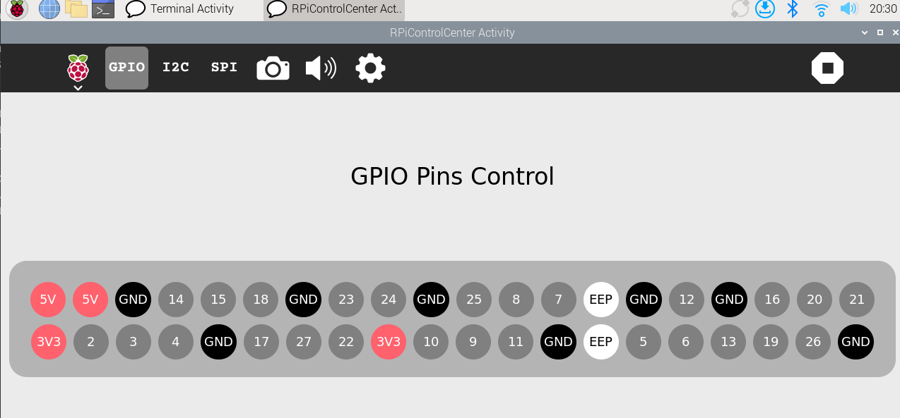
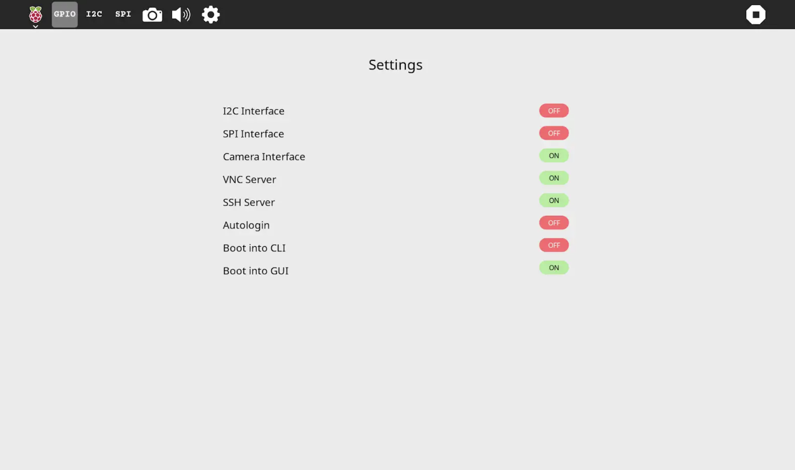

# RPi Control Center

A control center application for Raspberry Pi, designed to manage and monitor various Raspberry Pi functionalities through a user-friendly interface.

## Features
- **GPIO Control**: Control the GPIO pins on the Raspberry Pi.
- **I2C**: View and obtain addresses of connected I2C devices.
- **SPI**: View and obtain addresses of connected SPI devices.
- **Audio**: Check and manage connected speaker and microphone.
- **Camera**: View connected cameras.
- **Settings**: Control the state (on/off) of various settings such as I2C, SPI, VNC, Boot Splash, etc.

## Requirements
- Raspberry Pi with Sugar
- Python 3.x
- Required Python libraries:
  - `gi`
  - `psutil`
  - `RPi.GPIO`

## License

- This project is licensed under the GPL-2.0 License.

# Screenshots:

