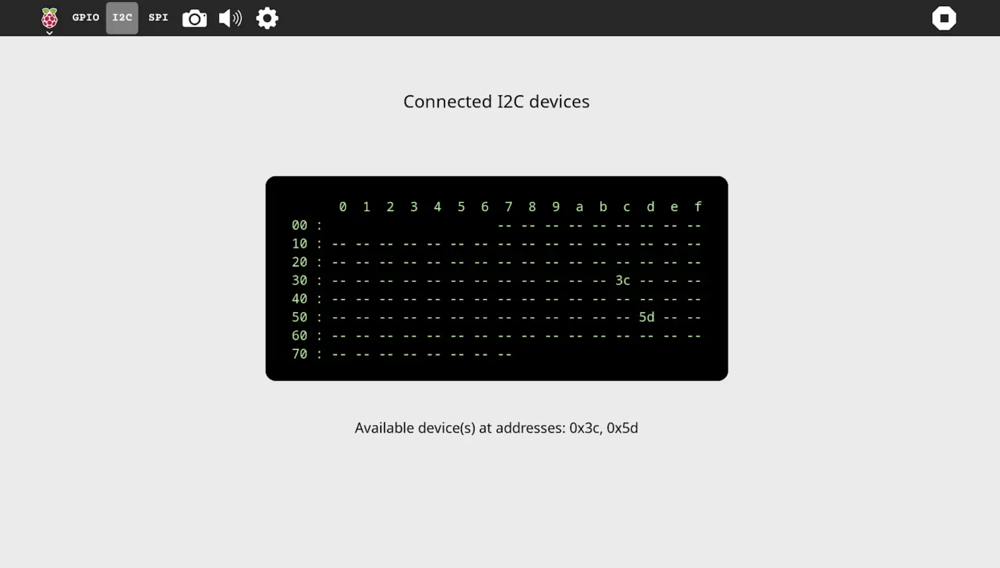

# RPi Control Center

A control center application for Raspberry Pi, designed to manage and monitor various Raspberry Pi functionalities through a user-friendly interface.

## Features
- **System Monitoring**: View system information such as CPU usage, memory usage, and disk space.
- **Process Management**: Monitor and manage running processes.
- **Network Monitoring**: View network statistics and active connections.
- **GPIO Control**: Control the GPIO pins on the Raspberry Pi.

## Requirements
- Raspberry Pi with Raspbian OS
- Python 3.x
- Required Python libraries:
  - `gi`
  - `psutil`
  - `RPi.GPIO`

## How to Use?
RPi Control Center is not integrated into the Sugar desktop by default but can be added. Please follow these steps:
- [Get Sugar on sugarlabs.org](https://sugarlabs.org/)
- [Learn how to use Sugar](https://help.sugarlabs.org/)

run with `sugar-activity3`
also compatible with `sugar-activity`

## License

- This project is licensed under the GPL-2.0 License.